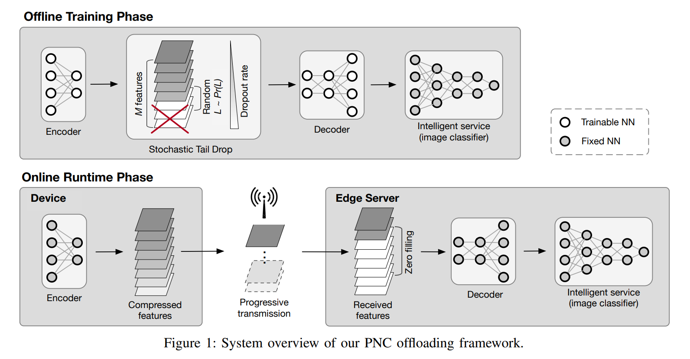

# Progressive-Neural-Compression
## Quick start with Progressive Neural Compression (PNC): 
* To quickly try PNC, the network and the checkpoints are in the `demo_simulation` folder. 
* To train PNC from scratch, please go to `training`. 
* The testbed implementation of PNC on Raspberry Pi 4 + nRF52840 development kits is at `testbed`.
* ***PyTorch***: We have included a PyTorch version of the Progressive Neural Compression (PNC) model in the `pnc_pytorch` directory.
* For any questions, please contact the first author.


## Introduction

This repository contains the source code and testbed setup instructions for **R. Wang, H. Liu, J. Qiu, M. Xu, R. Guerin, C. Lu, [Progressive Neural Compression for Adaptive Image Offloading under Timing Constraints](https://doi.org/10.1109/RTSS59052.2023.00020), IEEE Real-Time Systems Symposium ([RTSS'23](https://2023.rtss.org/)), December 2023.  [[IEEE Xplore](https://doi.org/10.1109/RTSS59052.2023.00020)]** [[arXiv](https://arxiv.org/pdf/2310.05306.pdf)] [[RTSS 2023 Proceedings](https://doi.ieeecomputersociety.org/10.1109/RTSS59052.2023.00020)]

🏆🤫 *This paper won "Outstanding Paper Award" and "[RTSS 2023 Best Student Paper Award](https://2023.rtss.org/awards/)."* 🌟🥇 Great thanks to everyone on the team.

<!--  -->

<div align="center">
  
  
  **Figure: Top-5 Accuracy vs the Datasize (KB) for different image compression techniques on the ImageNet dataset.** Quality factors (q) are annotated on the graph, showing how varying quality levels impact performance for some methods.




**Figure: Offline training phase and the online runtime phase.**
</div>

**This work is closely related to our *Edge Offloading* papers:**

* Qiu, J., Wang, R., Hu, B., Guérin, R., & Lu, C. (2024). **"Optimizing Edge Offloading Decisions for Object Detection."**
[[paper]](https://arxiv.org/abs/2410.18919)
[[code]](https://github.com/qiujiaming315/edgeml-object-detection/)

* Qiu, J., Wang, R., Chakrabarti, A., Guérin, R., & Lu, C. (2022). **"Adaptive Edge Offloading for Image Classification Under Rate Limit."**
[[paper]](https://ieeexplore.ieee.org/document/9852802)
[[code]](https://github.com/qiujiaming315/edgeml-dqn)


## Quick Demo
* Install the required environment, mainly TensorFlow and other related libraries (tensorflow-addons, tqd, etc.). We used tf.keras and the code should be compatible with most Tensorflow/Keras 2 versions >2.5 (but <=2.15, as 2.16 starts to use Keras 3), but if it raises an error please consider `tensorflow==2.8.0` (https://pypi.org/project/tensorflow/2.8.0/).
  > ⚠️ **Package versions:** Our edge server use Nvidia driver 510.47.03, CUDA version: 11.6. Python 3.8.8. `tensorflow==2.8.0`. If your python version is not among 3.7-3.10, you may encounter errors when installing `tensorflow==2.8.0` ([more details](https://www.tensorflow.org/install/source#gpu)).

  > ⚠️ **Keras 3 incompatibility:** In late 2023, Keras introduced the new [Keras 3](https://keras.io/keras_3/), which is not well compatible with Keras 2 and lower versions of tensorflow as of early 2024. This project can trace back to early 2021. The checkpoints were saved with Tensorflow/Keras version 2.8 (Keras 2). The EfficientNetB0 model was downloaded from the API and it was created officially by TF using version 2.5. We cannot guarantee that these models or checkpoints will work on different TF versions, which is common for tensorflow models. If you are unable to use the match versions, and found version compatibility errors, please consider re-save the  [EfficientNetB0](https://www.tensorflow.org/api_docs/python/tf/keras/applications/efficientnet/EfficientNetB0) and make necessary modifications to the code. 

* Put the ImageNet Val images (named as `ILSVRC2012_val_00000001.JPEG`, etc.) in `demo_simulation\val2017`. There are multiple sources to download this dataset, e.g. from [Kaggle ImageNet Object Localization Challenge](https://www.kaggle.com/competitions/imagenet-object-localization-challenge/data).
* The demo file is located at: `demo_simulation\pnc_demo_simulation.ipynb`

### Using the PyTorch Model

To get started with the PyTorch version of the Progressive Neural Compression (PNC) model, please refer to the Jupyter notebook provided:

1. Open `pnc_pytorch/pnc_pytorch.ipynb`.
2. Follow the step-by-step instructions in the notebook, which cover model definition, weight conversion from TensorFlow, and loading weights into the PyTorch model.

Please note that while this PyTorch version replicates the structure and functionality of the original TensorFlow model, it has not been fully tested on testbed for correctness.

## Autoencoder Network
We separate out the network, training and testbed into different folders so that user can pick the components they need conveniently. 

The network definition and checkpoint loading is located at: `demo_simulation/pnc_demo_network.ipynb`

```
# Encoder
encoder_input = layers.Input(shape=(img_height, img_width, 3))
initializer = tf.keras.initializers.Orthogonal()
encoder_x = layers.Conv2D(
    16, (9, 9), 
    strides=7, 
    activation="relu", 
    padding="same", 
    kernel_initializer=initializer
)(encoder_input)
encoder_x = layers.Conv2D(
    10, (3, 3), 
    strides=1,
    activation="relu", 
    padding="same", 
    kernel_initializer=initializer,
    name='encoder_out'
)(encoder_x)
encoder_model = keras.Model(encoder_input, encoder_x,  name='enocder')
```

Simply open it with jupyter notebook and run it.

The encoder model `demo_simulation/saved_tflite_models_demo/best_encoder_tuned_model_uint8.tflite` can be visualized by [Netron](https://netron.app/).
<div align="center">
   
  
  **Figure: An example visualization of the encoder model.**
</div>


## Experimental Setup
Instructions for experimental hardware and testbed setup can be found in [testbed/](https://github.com/rickywrq/Progressive-Neural-Compression/blob/main/testbed/)


## Citation

If you find our paper useful, please consider citing this in your publication.

```bibtex
@INPROCEEDINGS{10405983,
  author={Wang, Ruiqi and Liu, Hanyang and Qiu, Jiaming and Xu, Moran and Guérin, Roch and Lu, Chenyang},
  booktitle={2023 IEEE Real-Time Systems Symposium (RTSS)}, 
  title={Progressive Neural Compression for Adaptive Image Offloading Under Timing Constraints}, 
  year={2023},
  volume={},
  number={},
  pages={118-130},
  keywords={Performance evaluation;Image coding;Image edge detection;Bandwidth;Timing;Internet of Things;Servers;neural compression;edge offloading;image classification;real-time transmission},
  doi={10.1109/RTSS59052.2023.00020}}

```

